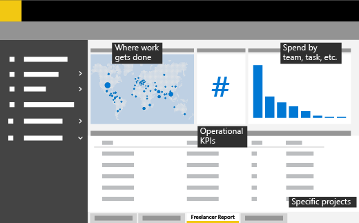

Tools and templates for data analytics
======================================

Start measuring business success through Power BI  
------------------------------------------------

Capture, track, and communicate program metrics, compare freelance KPIs to contingent program options, and identify groups that leverage the program most effectively using Power BI, a suite of business analytics tools that connect to hundreds of data sources, simplify data prep, and drive ad-hoc analysis. Along with publishing beautiful reports your organization can consume on the web and across mobile devices, Power BI scales across the enterprise with governance and security built-in.

Here's an illustration of the Power BI dashboard layout we used: 

Chad, a Procurement director at Microsoft, and his team of sourcing managers needed to measure the impact of our freelance program to see if it was effective and responsible. See how they did this with our best practices.

<ul class="panelContent cardsF cols cols2">
    <li>
        

            

                

                    

                        

                            
                        

                    

                    

                        <h3><a href="dataanalyticsbestpractices.md">Best practices</a></h3>
                        
Learn what's worked for us with these tips on setting up data analytics for an enterprise freelance program.

                    

                

            

        

    </li>
</ul>

Then start deploying data analytics within your freelance program through our custom Power BI connector and Power BI template. The connector pulls data from disparate sources into dashboards, and the sample visualizations help enterprises identify groups and their category spend to determine where freelance is most impactful.

<ul class="panelContent cardsF cols cols2">
    <li>
        

            

                

                    

                        

                            
                        

                    

                    

                        <h3><a href="datanalyticsdownloads.md">Deployment guide</a></h3>
                        
Use this deployment guide to start deploying Power BI for measuring program success within your organization.

                    

                

            

        

    </li>
</ul>

Customize your freelance program Power BI dashboard
---------------------------------------------------

While the connector and sample visualizations included in this toolkit will give you a starting point, there will still be work to customize a dashboard that reflects the specifics of your enterprise. You can [do this work yourself](https://docs.microsoft.com/power-bi/service-dashboard-create), but another option is to engage a freelancer to help with customization.

For example, here's a description that you could use to engage a freelancer to help customize your freelance program Power BI dashboard:

> ### Power BI consultant/architect needed to customize a dashboard
> *Looking for an experienced individual with advanced skills in Power BI to build dashboards and data visualizations for our key KPIs.*
> 
> *We will provide the Excel/Azure data, which needs to be converted into a consumable format for management that will help aid business decisions. We will need assistance with logical design, physical design, implementation, testing, and deployment of the end-to-end solution. The Power BI developer should have a firm grasp of BI implementation methodologies and will have had in-depth experience with the Microsoft BI stack (SSIS, SSRS, and SSAS).*
> 
> *Specific technical skills desired include: Relational database and SQL language, analytics/OLAP cube development, report development.*

Feedback
--------------------
We'd love to hear how we can make the toolkit better. [Let us know your feedback!](https://forms.office.com/Pages/ResponsePage.aspx?id=v4j5cvGGr0GRqy180BHbRyFR4rWSfFFLorGIaWbYznpUN0k2SVVTWEg0MVIzVFVTTkM5QzRFSlhSQS4u)

Want to know the status of your request? Or what other requests have been made? [Contact us to find out!](https://forms.office.com/Pages/ResponsePage.aspx?id=v4j5cvGGr0GRqy180BHbRyFR4rWSfFFLorGIaWbYznpUNDdHSU1YQjdVRlMyQlNCUUhDWVlJTkMwTS4u) 