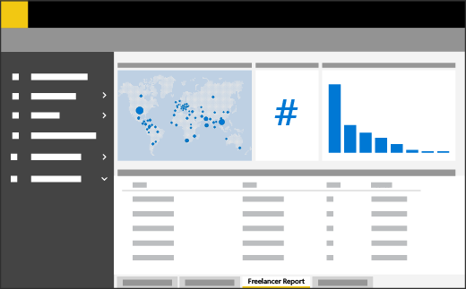

Data analytics 
===================

A major challenge in scaling an enterprise freelance program is tracking and communicating business performance via enterprise-specific KPIs. The volume and complexity within your enterprise can make data not only hard to capture, but hard to communicate effectively.

This effects:

-   Your ability to make data-driven decisions

-   Your ability to compare freelance spend with existing external staffing options

-   Your ability to identify which freelance talent categories work best within your organization's various groups

With [Microsoft Power BI](https://powerbi.microsoft.com/), a suite of business analytics tools, you can collect end-to-end, real time data from every source, and customize data visualization dashboards.

Case study: Increased adoption
-----------------------------

At Microsoft, we've found that data can be a powerful adoption driver for implementing a freelance program. By comparing freelance results with 

<ul class="panelContent cardsF">
    <li>
        

            

                

                    

                        

                            
                        

                    

                    

                        <h3>Case study</h3>
                        
Learn how Chad, a director of strategic sourcing, and a procurement leader on the Gig Economy v-team, increased spend and adoption of the freelance program by leveraging a data-centric approach.

                        
<a href="dataanalyticscasestudy.md">Learn more</a>

                    

                

            

        

    </li>
</ul>

Learn more with the following resources
-----------------------------------------
<ul class="panelContent cardsF cols cols2">
    <li>
        

            

                

                    

                        

                            
                        

                    

                    

                        <h3>Case study</h3>
                        
Learn how Chad, a director of strategic sourcing, and a procurement leader on the Gig Economy v-team, increased spend and adoption of the freelance program by leveraging a data-centric approach.

                        
<a href="dataanalyticscasestudy.md">Learn more</a>

                    

                

            

        

    </li>
    <li>
        

            

                

                    

                        

                            
                        

                    

                    

                        <h3>PowerBI engagement template</h3>
                        
Start customizing your PowerBI Dashboard in accordance with your enterprise today. We have curated many of our engagement best practices, including the ideal job description, skills needed, and price point.

                        
<a href="powerbiengagementtemplate.md">View the PowerBI engagement template</a>

                    

                

            

        

    </li>
    <li>
        

            

                

                    

                        

                            
                        

                    

                    

                        <h3>Share within your organization</h3>
                        
Download an infographic to share how your organization can drive awareness amongst internal stakeholders and adopters with this PowerBI visual one-page guide.

                        
<a href="media/M365-FreelanceToolkit-TearSheet-DataAnalytics.pdf">Download the infographic</a>

                    

                

            

        

    </li>
</ul>

