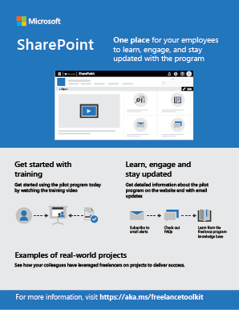
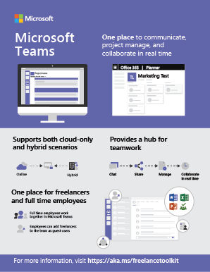
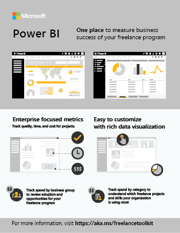

Microsoft 365 Freelance Toolkit
===============================

The Microsoft 365 Freelance Toolkit builds on your existing technology investments and provides tools, templates, and best practices that help enterprises launch, execute, and manage freelance programs at scale.

This [solution overview package](https://placeholderfordownloadlink) provides infographics and slides to help drive stakeholder discussion around how your existing Microsoft 365 investments can help support an enterprise freelance program.

<ul class="panelContent cardsW cols cols2">
    <li>
        

            

                

                    

                        

                            
                        

                    

                    

                        <h3>Internal communication</h3>
                        
Provide employees with a place to learn about the program, access required training, and review best practices.

                        
<a href="internalcommunicationsection.md">LEARN MORE</a>

                    

                

            

        

    </li>
    <li>
        

            

                

                    

                        

                            
                        

                    

                    

                        <h3>Team-wide collaboration</h3>
                        
Enable employees and freelancers to work together on files, manage tasks, and communicate across time zones.

                        
<a href="teamwidecollaborationsection.md">LEARN MORE</a>

                    

                

            

        

    </li>
    <li>
        

            

                

                    

                        

                            
                        

                    

                    

                        <h3>Data analytics</h3>
                        
Capture, track, and communicate KPIs for your enterprise freelance program.

                        
<a href="dataanalyticssection.md">LEARN MORE</a>

                    

                

            

        

    </li>
    <li>
        

            

                

                    

                        

                            
                        

                    

                    

                        <h3>Workflow automation</h3>
                        
Reduce the need for manual completion of repetitive provisioning, compliance, and monitoring tasks.

                        
<a href="workflowautomationsection.md">LEARN MORE</a>

                    

                

            

        

    </li>
</ul>

Ready to drive discussion?
---------------------------------------------------

Download these resources to share within your organization.

<ul class="panelContent cardsW">
    <li>
        <a href="media/M365-FreelanceToolkit-TearSheet-FreelanceProgram.pdf">
        

            

                

                    

                        

                            
                        

                    

                    

                        <h3>Freelance program</h3>
                        
Download an infographic about how you can set up a freelance program in your organization.

                    

                

            

        

        </a>
    </li>
    <li>
        <a href="media/M365-FreelanceToolkit-TearSheet-InternalCommunication.pdf">
        

            

                

                    

                        

                            
                        

                    

                    

                        <h3>Internal communications</h3>
                        
Download an infographic to share how your organization can drive awareness amongst internal stakeholders and adopters with this visual one-page guide.

                    

                

            

        

        </a>
    </li>
    <li>
        <a href="media/M365-FreelanceToolkit-TearSheet-TeamCollaboration.pdf">
        

            

                

                    

                        

                            
                        

                    

                    

                        <h3>Team collaboration</h3>
                        
Download an infographic to share how your organization can internally transform the way you communicate, collaborate, and project manage a hybrid full-time-employee and freelance workforce.

                    

                

            

        

        </a>
    </li>
    <li>
        <a href="media/M365-FreelanceToolkit-TearSheet-DataAnalytics.pdf">
        

            

                

                    

                        

                            
                        

                    

                    

                        <h3>Data analytics</h3>
                        
Download an infographic to share how your organization can drive awareness amongst internal stakeholders and adopters with this PowerBI visual one-page guide.

                    

                

            

        

        </a>
    </li>
    <li>
        <a href="media/M365-FreelanceToolkit-TearSheet-WorkFlowAutomation.pdf">
        

            

                

                    

                        

                            
                        

                    

                    

                        <h3>Workflow automation</h3>
                        
Download an infographic to share how your organization can drive awareness amongst internal stakeholders and adopters with this visual one-page guide.

                    

                

            

        

        </a>
    </li>
</ul>