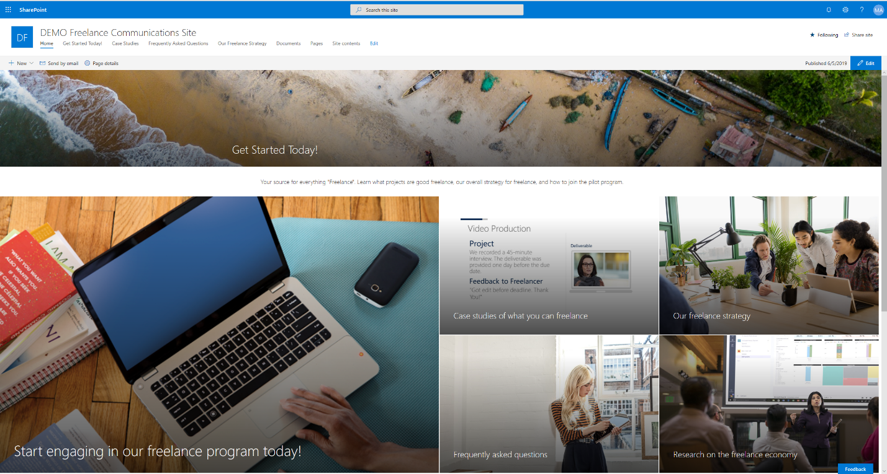

Deploy internal communication with a SharePoint site
=========================================

We offer a SharePoint Online communication site template that you can add to your Microsoft 365 tenant.

## Template contents
The template contains the following structures and assets:
- Welcome page
- 5 additional content pages
- Sample PowerPoint file in the Documents folder
- Sample image content used in the template

## Prerequisites
Here are current prerequisites for making this solution work in your tenant.
- You will need to be a tenant administrator to be able to deploy this solution to the target tenant.  
    If needed, you can get a free developer tenant from the <a href="https://developer.microsoft.com/en-us/office/dev-program">Office 365 developer program</a>.
- Automatic end-to-end provisioning currently works only with English language tenants. 

## Deployment steps
1.	On the <a href="https://provisioning.sharepointpnp.com/" target="_blank">SharePoint provisioning site</a>, choose **Sign In** and use your tenant admin credentials.
2.	Choose **Add to your tenant**.
3.	On the **Provisioning** page, choose **Provision**.

**Note:** If you experience issues logging into the provisioning site, please use Google Chrome browser. 

It takes about 5 minutes for the provisioning to complete. After is has completed, you can click the site URL on the page to launch the template.

Feedback
--------------------
We'd love to hear how we can make the toolkit better. [Let us know your feedback!](https://forms.office.com/Pages/ResponsePage.aspx?id=v4j5cvGGr0GRqy180BHbRyFR4rWSfFFLorGIaWbYznpUN0k2SVVTWEg0MVIzVFVTTkM5QzRFSlhSQS4u)

Want to know the status of your request? Or what other requests have been made? [Contact us to find out!](https://forms.office.com/Pages/ResponsePage.aspx?id=v4j5cvGGr0GRqy180BHbRyFR4rWSfFFLorGIaWbYznpUNDdHSU1YQjdVRlMyQlNCUUhDWVlJTkMwTS4u) 