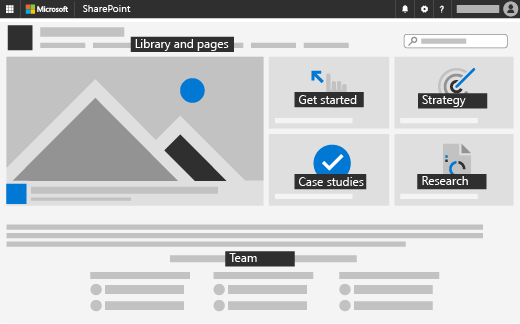

Deploy internal communication with a SharePoint site
=========================================

Use these resources to start deploying your SharePoint communications site.

**Step 1:** Deploy <a href="https://support.office.com/article/create-a-communication-site-in-sharepoint-online-7fb44b20-a72f-4d2c-9173-fc8f59ba50eb">SharePoint communications site</a>.

**Step 2:** Build out your communication site. 
Here's an illustration of the home page layout we used:

We recommend starting with the following web parts and content:
- A home page with a <a href="https://support.office.com/article/Use-the-Hero-web-part-D57F449B-19A0-4B0D-8CE3-BE5866430645">Hero</a> web part in the Topic style layout that points to:
    - "Get started" information about your program
    - Information about your strategy
    - Case studies (you can start with the case studies we have provided below)
    - Research (you can start with the research we provide below)
    - A section on the home page that provides information about the team behind your program. We used a series of <a href="https://support.office.com/article/Show-people-profiles-on-your-page-with-the-People-web-part-7E52C5F6-2D72-48FA-A9D3-D2750765FA05">People</a> web parts with the Compact layout that listed the team members for each department.
- A <a href="https://support.office.com/article/introduction-to-libraries-7d4221d9-8fb9-40d5-8441-2374c84b5e26">SharePoint document library</a> to host relevant documentation and presentations about the program.
- An FAQ page seeded with top questions from enterprise employees (you can start with the FAQ questions we have provided below)
- Pages to host the research, strategy, case studies, videos, and events you might provide for your Enterprise.
    - We used the <a href="https://support.office.com/article/use-the-quick-links-web-part-e1df7561-209d-4362-96d4-469f85ab2a82">Quick links</a> web part with a Filmstrip layout to host the research papers with preview thumbnail images.
If you are the author, make sure to publish every edited page. Otherwise, edited pages will only visible to you as the author. 

**Step 3:** Use the below content as a starting point to fill out the resources on your SharePoint communication site.

<ul class="panelContent cardsF cols cols2">
    <li>
        

            

                

                    

                        

                            
                        

                    

                    

                        <h3><a href="media\downloads\CaseStudies.pdf">Use cases</a></h3>
                        
Show your employees the kinds of projects they can get done with freelancers.

                    

                

            

        

    </li>
    <li>
        

            

                

                    

                        

                            
                        

                    

                    

                        <h3><a href="media\downloads\FrequentlyAskedQuestions.pdf">FAQ</a></h3>
                        
Answer these common questions that your employees might have.

                    

                

            

        

    </li>
</ul>

<ul class="panelContent cardsF cols cols2">
    <li>
        

            

                

                    

                        

                            
                        

                    

                    

                        <h3>Research - Distribute industry research reports about freelance work and Enterprise organizations:</a></h3>
                        
<a href="http://www.cvent.com/events/2019-collaboration-in-the-gig-economy-europe/custom-19-8e0bdbc22c7643cfaea5779b421ba767.aspx">The Gig Economy and Human Cloud Landscape: 2018 Update</a>

                        
<a href="https://www.nber.org/papers/w22667.pdf">The Rise and Nature of Alternative Work Arrangements in the United States, 1995-2015</a>

                        
<a href="https://advisory.kpmg.us/content/dam/advisory/en/pdfs/boundaryless-workforce.pdf">KPMG: Ready for a boundaryless workforce?</a>

                    

                

            

        

    </li>
</ul>

**There are no access controls relevant for deploying your SharePoint Communications Site. For all access controls needed for this toolkit, refer to [Deploy team-wide collaboration](teamwidecollaborationdownload.md).**

Feedback
--------------------
We'd love to hear how we can make the toolkit better. [Let us know your feedback!](https://forms.office.com/Pages/ResponsePage.aspx?id=v4j5cvGGr0GRqy180BHbRyFR4rWSfFFLorGIaWbYznpUN0k2SVVTWEg0MVIzVFVTTkM5QzRFSlhSQS4u)