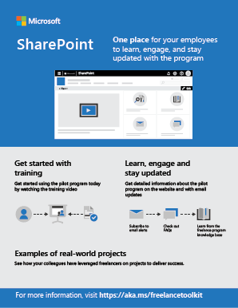
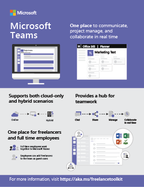
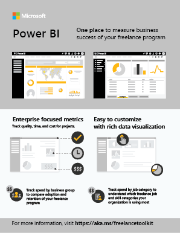
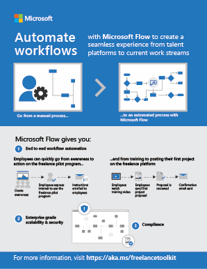

Microsoft 365 freelance toolkit overview resources
============================================================

These videos, infographics, and slides were designed to help you drive stakeholder discussion around how your existing investments in Microsoft 365 can help support an enterprise freelance program.

Videos
----------------
Overview of Microsoft 365 freelance toolkit 
> [!VIDEO https://videoplayercdn.osi.office.net/hub/?csid=ux-cms-en-us-msoffice&uuid=RE2IVJd&AutoPlayVideo=false]

Using Microsoft Teams as a hub for teamwork between full time employees and freelancers
> [!VIDEO https://videoplayercdn.osi.office.net/hub/?csid=ux-cms-en-us-msoffice&uuid=RWm2wV&AutoPlayVideo=false]

Engaging freelancers for Office templates 
> [!VIDEO https://videoplayercdn.osi.office.net/hub/?csid=ux-cms-en-us-msoffice&uuid=RE2IQuV&AutoPlayVideo=false]

Presentation
----------------
[Presentation: Embracing freelance within your enterprise](media/downloads/Microsoft-365-freelance-toolkit-EmbracingFreelance.pdf)
<b>Use this presentation as a starting point to drive awareness and understanding of freelance within the enterprise.</b>  

Infographics
----------------

<ul class="panelContent cardsW">
    <li>
        

            

                

                    

                        

                            
                        

                    

                    

                        
<a href="media/M365-FreelanceToolkit-TearSheet-FreelanceProgram.pdf"><b>Freelance program</b></a>

                        
Understand the steps to launch a freelance program in your organization with this infographic.

                    

                

            

        

    </li>
    <li>
        

            

                

                    

                        

                            
                        

                    

                    

                        
<a href="media/M365-FreelanceToolkit-TearSheet-InternalCommunication.pdf"><b>Internal communications</b></a>

                        
Drive awareness amongst internal stakeholders and adopters with this visual one-page guide to your internal communications site.

                    

                

            

        

    </li>
    <li>
        

            

                

                    

                        

                            
                        

                    

                    

                        
<a href="media/M365-FreelanceToolkit-TearSheet-TeamCollaboration.pdf"><b>Team collaboration</b></a>

                        
Share how your organization can internally transform the way you communicate, collaborate, and project manage a hybrid full-time-employee and freelance workforce.

                    

                

            

        

    </li>
    <li>
        

            

                

                    

                        

                            
                        

                    

                    

                        
<b><a href="media/M365-FreelanceToolkit-TearSheet-DataAnalytics.pdf">Data analytics</b></a>

                        
Share how your organization can use data analytics to measure the success of your freelance program.

                    

                

            

        

    </li>
    <li>
        

            

                

                    

                        

                            
                        

                    

                    

                        
<a href="media/M365-FreelanceToolkit-TearSheet-WorkFlowAutomation.pdf"><b>Workflow automation</b></a>

                        
Share how your organization can automate workflows easily with Microsoft Flow.

                    

                

            

        

    </li>
</ul>