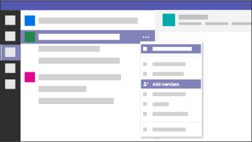

Team-wide collaboration
===========================

While today’s freelancer tools work fine for 1:1 discussions, most enterprise projects are many:many where team members collaborate on projects in groups with many different working files and communication channels. To keep teams moving in the same direction while on various continents and various roles, they need one place to communicate and collaborate.

[Microsoft Teams](https://products.office.com/en-us/microsoft-teams/free) enables FTEs and freelancers to collaborate seamlessly, and supports integration with other Microsoft applications, such as [Microsoft Planner](https://products.office.com/en-us/business/task-management-software), as well as hundreds of third-party applications that your teams use to get work done.
<ul class="panelContent cardsW cols cols2">
    <li>
        

            

                

                    

                        

                            
                        

                    

                    

                        <h3>Communicate</h3>
                        
Teams have access to public and private discussion channels, visible to all applicable stakeholders for transparent collaboration.

                    

                

            

        

    </li>
    <li>
        

            

                

                    

                        

                            
                        

                    

                    

                        <h3>Manage tasks</h3>
                        
Teams have one place to manage projects, track progress, and align on workflow.

                    

                

            

        

    </li>
    <li>
        

            

                

                    

                        

                            
                        

                    

                    

                        <h3>Collaborate</h3>
                        
Cloud-based file storage ensures everyone is working on current versions of team documents. Files are tied directly to their tasks in Planner, and can be retrieved through intelligent search.

                    

                

            

        

    </li>
    <li>
        

            

                

                    

                        

                            
                        

                    

                    

                        <h3>Work with external users</h3>
                        
Teams working with freelancers need the ability to invite external users to collaborate, with free access to those collaboration tools.

                    

                

            

        

    </li>
</ul>

Case study: Increased output
----------------------------

Because the team producing Office training content moved all of their operations into Microsoft Teams and Planner, they were able to increase their output and deliver more value to customers.

<ul class="panelContent cardsF">
    <li>
        

            

                

                    

                        

                            
                        

                    

                    

                        
Learn how Beth, a training manager at Microsoft leading a team of four FTEs and a continuous flow of freelancers, increased her teams training video output by 120% through internally transforming the way they communicated, collaborated, and project managed the production of training videos.

                        
<a href="teamwidecollaborationcasestudy.md">LEARN MORE</a>

                    

                

            

        

    </li>
</ul>

Ready to get started?
---------------------

<ol>
    <li>
        
Your first step is to understand how your employees can collaborate with freelancers in Microsoft Teams.

        <ul>
            <li>
                
Employees can <a href="https://support.office.com/article/6723dc43-dbc0-46e6-af49-8a2d1c5cb937">sign in to Microsoft Teams</a> and then <a href="https://support.office.com/article/702a2977-e662-4038-bef5-bdf8ee47b17b">set up a team</a> where they will collaborate with freelancers.

            </li>
            <li>
                
Once their team is set up, they can <a href="https://support.office.com/article/fccb4fa6-f864-4508-bdde-256e7384a14f">invite freelancers to join the team as guests</a>.

            </li>
        </ul>
        
<a href="https://support.office.com/article/d03fdf5b-1a6e-48e4-8e07-b13e1350ec7b">What can guests do in Microsoft Teams?</a>

    </li>
    <li>
        
Next, let your employees know what's possible!

        <ul class="panelContent cardsF cols cols1">
            <li>
                

                    

                        

                            

                                

                                    
                                

                            

                            

                                
This infographic can help employees understand how to use Microsoft Teams and Planner to transform the way they communicate, collaborate, and project manage a hybrid FTE and freelance workforce.

                                
<a href="media/M365-FreelanceToolkit-TearSheet-TeamCollaboration.pdf">DOWNLOAD</a>

                            

                        

                    

                

            </li>
        </ul>
    </li>
</ul>