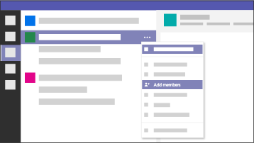

Tools and templates for team-wide collaboration
========================================================

The Microsoft 365 Freelance Toolkit uses your existing investments in [Microsoft Teams](https://products.office.com/microsoft-teams/group-chat-software) and [Microsoft Planner](https://products.office.com/business/task-management-software) to help you streamline collaboration between full time employees and cross-functional, multi-geographical freelance teams.

With Teams and Planner, enterprises can manage their freelance collaboration needs, specifically: 
- **Communication.** Public and private teams for members to engage in discussion. 
- **Task management.** One place to track project progress and align each team member's assignments.
- **File storage.** One place to store shared files and retrieve them through intelligent search.
- **Guest Access.** With [Microsoft Teams free](https://products.office.com/microsoft-teams/free), freelancers can join and exit your team as needed, with no cost or commitment. Employees can provide freelancers with [external guest access](https://support.office.com/article/fccb4fa6-f864-4508-bdde-256e7384a14f) to their teams, giving everyone a single place to collaborate on tasks. 

> [!VIDEO https://videoplayercdn.osi.office.net/hub/?csid=ux-cms-en-us-msoffice&uuid=RE1LGec&AutoPlayVideo=false]

For Beth, a training manager at Microsoft who managed a team of four full time employees and engaged a continuous flow of freelancers, switching her operations [Microsoft Teams](https://products.office.com/microsoft-teams/group-chat-software) and [Microsoft Planner](https://products.office.com/business/task-management-software) enabled her team to exceed their production goals. Learn how she did this and how your organization can do this with our best practices.  

<ul class="panelContent cardsF cols cols2">
    <li>
        

            

                

                    

                        

                            
                        

                    

                    

                        <h3><a href="teamwidecollaborationbestpractices.md">Best practices</a></h3>
                        
Learn what's worked for us with these tips on streamlining collaboration between employees and freelancers.

                    

                

            

        

    </li>
</ul>

Then start deploying Teams within your organization. 

<ul class="panelContent cardsF cols cols2">
    <li>
        

            

                

                    

                        

                            
                        

                    

                    

                        <h3><a href="teamwidecollaborationdownload.md">Deployment guide</a></h3>
                        
Use this deployment guide to start deploying Microsoft Teams for team-wide collaboration within your organization.

                    

                

            

        

    </li>
</ul>

The below links are a starting point for using Teams as your one hub for teamwork between full time employees and cross-functional, multi-geographical freelance teams. 

- [Invite people to Microsoft Teams free](https://support.office.com/article/bf6ab877-9d55-493c-a3c2-08dab08b5083)
- [Differences between Microsoft Teams and Microsoft Teams free](https://support.office.com/article/0b69cf39-eb52-49af-b255-60d46fdf8a9c)
- [Guest capabilities in Microsoft Teams](https://support.office.com/article/d03fdf5b-1a6e-48e4-8e07-b13e1350ec7b)
